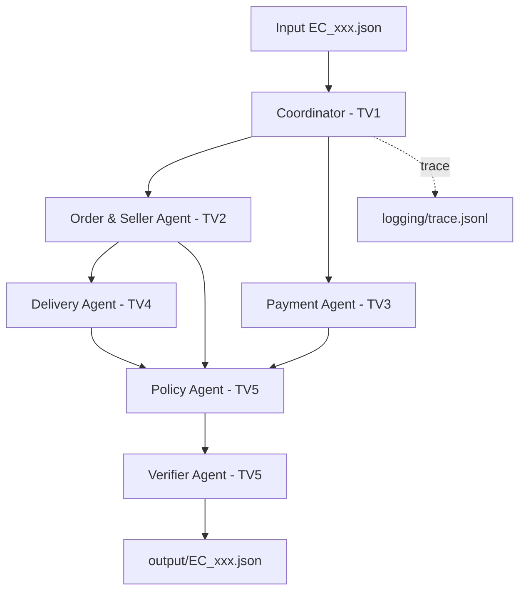

# Kiến trúc Multi-Agent E-commerce Dispute Resolution

> Trạng thái: placeholder. Cả nhóm cập nhật nội dung khi hoàn thiện module.

## 1. Sơ đồ hệ thống



## 2. Ownership

| Thành viên | Module | Trách nhiệm |
|---|---|---|
| TV1 | `data_loader.py`, `coordinator.py`, `cli.py`, `trace_logger.py` | Khung, dữ liệu, điều phối, CLI, trace và tích hợp |
| TV2 | `agents/order_seller.py` | Order, item, seller và seller handoff |
| TV3 | `agents/payment.py` | Đối soát item, freight, payment và refund inputs |
| TV4 | `agents/delivery.py` | Giao trễ và trách nhiệm seller/logistics |
| TV5 | `agents/policy.py`, `agents/verifier.py` | Policy priority, schema, evidence và output |

## 3. Contract handoff

Các contract được định nghĩa tập trung trong `src/models.py`. Agent không tự ý
thay đổi field mà chưa được nhóm thống nhất. Tiền dùng `Decimal`, chỉ làm tròn
hai chữ số tại ranh giới output.

## 4. Quyền truy cập dữ liệu

- Coordinator sở hữu một `OlistDataLoader` dùng chung.
- Order/Seller và Payment Agent được truy vấn loader qua API công khai.
- Delivery Agent chỉ nhận `OrderAnalysis`, không đọc CSV trực tiếp.
- Policy và Verifier chỉ nhận các báo cáo đã phân tích, không tự suy diễn dữ liệu mới.

## 5. Luồng lỗi và trace

<!-- TODO(TV1): mô tả exception contract, retry/fail-fast và các event JSONL. -->

## 6. Cách chạy

```powershell
python run.py --case EC_001
python run.py --input-dir input --output-dir output
```

<!-- TODO(TV1): cập nhật lệnh kiểm thử và kết quả chạy đủ 50 case. -->
