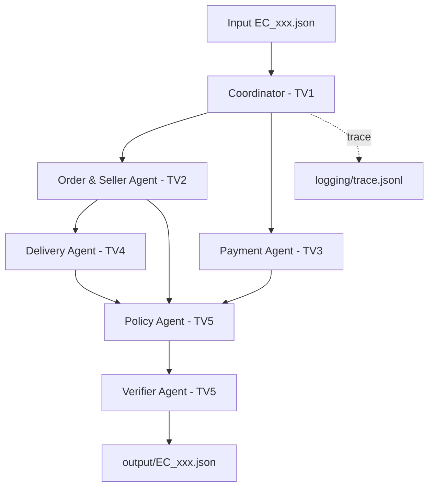

# Kiến trúc Multi-Agent E-commerce Dispute Resolution

> Trạng thái: khung tích hợp TV1 đã hoàn thành; Policy/Verifier của TV5 đã qua
> contract test; logic nghiệp vụ TV2–TV4 đang chờ tích hợp.

## 1. Sơ đồ hệ thống



## 2. Ownership

| Thành viên | Module | Trách nhiệm |
|---|---|---|
| TV1 | `data_loader.py`, `coordinator.py`, `cli.py`, `trace_logger.py` | Khung, dữ liệu, điều phối, CLI, trace và tích hợp |
| TV2 | `agents/order_seller.py` | Order, item, seller và seller handoff |
| TV3 | `agents/payment.py` | Đối soát item, freight, payment và refund inputs |
| TV4 | `agents/delivery.py` | Giao trễ và trách nhiệm seller/logistics |
| TV5 | `agents/policy.py`, `agents/verifier.py` | Policy priority, schema, evidence và output |

## 3. Contract handoff

Các contract được định nghĩa tập trung trong `src/models.py`. Agent không tự ý
thay đổi field mà chưa được nhóm thống nhất. Tiền dùng `Decimal`, chỉ làm tròn
hai chữ số tại ranh giới output.

| Handoff | Input | Output |
|---|---|---|
| Coordinator → Order/Seller | `CaseInput`, `OlistDataLoader` | `OrderAnalysis` |
| Coordinator → Payment | `CaseInput`, `OlistDataLoader` | `PaymentAnalysis` |
| Order/Seller → Delivery | `CaseInput`, `OrderAnalysis` | `DeliveryAnalysis` |
| Ba analysis → Policy | `CaseInput` và ba báo cáo | `PolicyDecision` |
| Policy → Verifier | Toàn bộ báo cáo và quyết định | `FinalCaseOutput` |

## 4. Quyền truy cập dữ liệu

- Coordinator sở hữu một `OlistDataLoader` dùng chung.
- Order/Seller và Payment Agent được truy vấn loader qua API công khai.
- Delivery Agent chỉ nhận `OrderAnalysis`, không đọc CSV trực tiếp.
- Policy và Verifier chỉ nhận các báo cáo đã phân tích, không tự suy diễn dữ liệu mới.

## 5. Luồng lỗi và trace

- Mỗi case được cô lập: lỗi một case được ghi vào `BatchResult.errors` và pipeline
  tiếp tục case kế tiếp.
- `--fail-fast` dừng tại lỗi đầu tiên nhưng vẫn giữ trace đã ghi.
- Coordinator ghi `case_failed` rồi truyền exception cho BatchRunner; không tự tạo
  output thay thế khi verifier hoặc agent thất bại.
- Trace được reset ở đầu mỗi lượt chạy và có các event `case_started`,
  `agent_started`, `analysis_completed`, `verification_passed`, `output_written`,
  `case_completed` hoặc `case_failed`.
- Output được ghi qua file tạm trong cùng thư mục rồi atomic replace, tránh để lại
  JSON chưa hoàn chỉnh nếu tiến trình bị gián đoạn.

## 6. Data access

`OlistDataLoader` chỉ đọc bốn bảng cần cho policy: orders, order items, order
payments và sellers. Loader tạo index một lần khi khởi động, trả defensive copy
cho caller và không cho agent quét CSV độc lập.

## 7. Cách chạy

```powershell
python run.py --case EC_001
python run.py --input-dir input --output-dir output
python run.py --validate-only
python run.py --fail-fast
```

Kiểm thử phần tích hợp độc lập với agent nghiệp vụ:

```powershell
python -m unittest discover -v
```

## 8. Trạng thái tích hợp

- Hoàn thành: contract, loader, Coordinator, trace, batch runner, output writer,
  CLI, input validation và test bằng fake agents.
- Đã kiểm tra contract với Policy/Verifier hiện tại của TV5.
- Chờ TV2–TV4: triển khai Order/Seller, Payment và Delivery Agent; sau đó chạy
  test sáu nhánh policy bằng kết quả nghiệp vụ thật.
